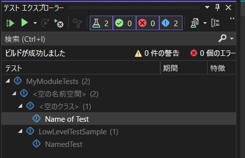
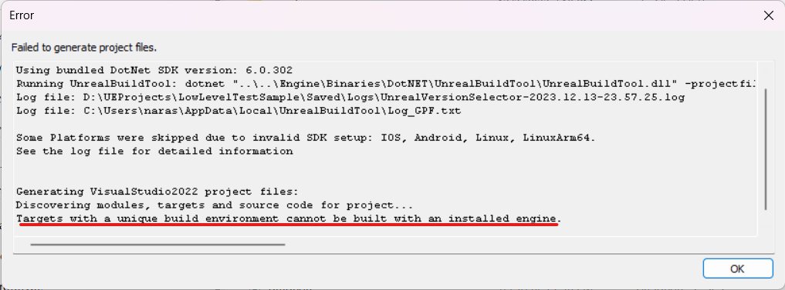
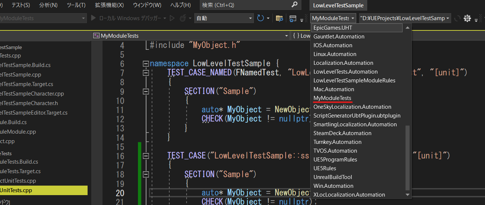
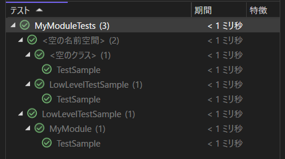

# [UE5] 「低レベルテスト」を利用してユニットテストを書く方法
今回は、機能としては以前から存在していたものの、UE5.3でドキュメントが追加されていた低レベルテスト(LowLevelTest, LLT)というテストフレームワークを見つけたので、これを使ってユニットテストを書いてみようと思います。  

https://docs.unrealengine.com/5.3/ja/low-level-tests-in-unreal-engine/

また、サンプルプロジェクトを公開していますので、コード全体については以下をご確認ください。  

https://github.com/narasan49/LowLevelTestSample  

## 低レベルテストとは

低レベルテストはUE5で利用可能な、GoogleTestやCatch2といったテストフレームワークをUEで利用可能にするためのフレームワークです。  

ユニットテストとは、簡単にいうと開発者が自身で記述するテストで、関数やクラスなどごく小さい単位で行うテストを指すことが多いです。低レベルテストでは、ユニットテスト以外のテストでも利用できますが、今回は触れません。  

低レベルテストのほかにも、Unreal EngineでC++のテストを書こうと思った場合、[Automation Spec](https://docs.unrealengine.com/5.3/ja/automation-spec-in-unreal-engine/)や[Automation Testing](https://docs.unrealengine.com/5.3/ja/automation-technical-guide/)といったテストフレームワークを利用することができます。
これらのテストフレームワークは、実行するためにはUEを起動する必要があるため、ビルドやコミットの度にテストを実行したいユニットテストの用途としては、実行速度に難がありました。

そこで、低レベルテストが彗星のごとく現れました。低レベルテストは、テストコードを書くモジュールを単独の実行ファイルとしてビルドするため、**エディターを起動することなく**テストを実行することができ、実装->テストのイテレーションを高速に回すことができるようになります。
また、
> LLT は UObjects、アセット、エンジン コンポーネント などのさまざまな UE 機能で動作するように作成されています。

と、ドキュメントにあるように、UEの主要な機能も利用することができるようです。

低レベルテストを利用すると、以下のようにテストを記述することができ、Visual Studioのテストエクスプローラーからも一覧を見ることができるようになります([Rider](https://www.jetbrains.com/ja-jp/rider/)は既存のテストもIDE上で表示・実行です。Visual Studio 2022も私は未確認ですが[バージョン17.8](https://learn.microsoft.com/ja-jp/visualstudio/releases/2022/release-notes#c-and-game-development-1)で対応したようです)。  
```cpp
#include "CoreMinimal.h"
#include "TestHarness.h"

#include "MyObject.h"

namespace LowLevelTestSample {
    TEST_CASE("TestSample", "[unit]")
	{
		SECTION("Sample")
		{
            TSharedPtr<FMySimpleClass> MySimpleObject = MakeShared<FMySimpleClass>();
			CHECK(MySimpleObject.IsValid());
		}
	}
}
```



低レベルテストには、テストモジュールを作成して記述する[明示的テスト](https://docs.unrealengine.com/5.3/ja/types-of-low-level-tests-in-unreal-engine/#明示的なテスト)、記述場所に制約のない[暗黙的テスト](https://docs.unrealengine.com/5.3/ja/types-of-low-level-tests-in-unreal-engine/#暗黙的テスト)があるようですが、現時点では、Visual Studioからテストを実行するには[明示的テストを利用する必要がある](https://docs.unrealengine.com/5.3/ja/build-and-run-low-level-tests-in-unreal-engine/#:~:text=%E8%AA%AC%E6%98%8E%E3%81%97%E3%81%BE%E3%81%99%E3%80%82-,Visual%20Studio,-%E6%98%8E%E7%A4%BA%E7%9A%84%E3%81%AA)ようです。  
今回は明示的テストに絞った紹介をしていきます。  

## 環境
今回、検証した環境は以下のようになります
- Windows 11
- Visual Studio 2022
    - 以下のパスにあるVS拡張機能、UnrealVSをインストールします。  
    "{エンジンフォルダ}\Engine\Extras\UnrealVS\VS2022\UnrealVS.vsix"
- VS Code  
    モジュールを記述する際に利用しています。  
- GitHub版 Unreal Engine 5.3  
    https://github.com/EpicGames/UnrealEngine  
    執筆時点ではLauncher版を利用することはできませんでした。  

## モジュールを作成する  
では、ここから実際に最初のテストを記述するまでのセットアップを行っていきます。明示的テストを記述するためには、テスト用のモジュールを作成する必要があり、そのパスは`{プロジェクトのパス}\Source\Programs`以下になります。  
ここでは、テスト対象もモジュール(`MyModule`)であるとして、テスト用モジュールの名前を`MyModuleTests`とします。まずは、  
- `Source\Programs\MyModule\MyModuleTests.Build.cs`
- `Source\Programs\MyModule\MyModuleTests.Target.cs`

の二つのファイルを作成してください。プロジェクトのフォルダ構成としては以下のようになります。
```
{プロジェクトのパス}\Source
├─LowLevelTestSample (プロジェクトフォルダ)
├─MyModule (テスト対象のモジュール)
│  ├─Private
│  ├─Public
│  └─MyModule.Build.cs
├─Programs
│   └─MyModule
│       ├─MyModuleTests.Build.cs
│       └─MyModuleTests.Target.cs
└─LowLevelTestSample.uproject
```

ビルドファイル、ターゲットファイル、それぞれの中身は以下のように記載します。  

- `MyModuleTests.Build.cs`: 
    ```cs
    using UnrealBuildTool;

    public class MyModuleTests : TestModuleRules
    {
        public MyModuleTests(ReadOnlyTargetRules Target) : base(Target)
        {
            PrivateDependencyModuleNames.AddRange(new string[] {
                "Core",
                "CoreUObject",
                "MyModule",
            });

            PublicIncludePathModuleNames.AddRange(new string[]
            {
                "MyModule",
            });
        }
    }
    ```
- `MyModuleTests.Target.cs`: 
    ```cs
    using UnrealBuildTool;

    [SupportedPlatforms(UnrealPlatformClass.All)]
    public class MyModuleTestsTarget: TestTargetRules
    {
        public MyModuleTestsTarget(TargetInfo Target): base(Target)
        {
            // 必要に応じてビルドに含めるコア機能を決める
            bCompileAgainstCoreUObject = true;
            bCompileAgainstApplicationCore = true;
            // bCompileAgainstEngine = true;
        }
    }
    ```

さらに、プロジェクトファイル(.uproject)にモジュールの情報を追記します。
- `LowLevelTestSample.uproject(抜粋)`
    ```json
        "Modules": [
            {
                "Name": "LowLevelTestSample",
                "Type": "Runtime",
                "LoadingPhase": "Default"
            },
            {
                "Name": "MyModule",
                "Type": "Runtime"
            }
        ],
    ```

それぞれ、解説していきます。  


### ビルドファイル
テストモジュール用のベースクラス`TestModuleRules`を継承し、通常のビルドファイル同様、必要な依存関係を定義します。  
UE5.3時点では、テストモジュール用のクラスをLauncher版で利用することができないようで、プロジェクトを切り替えようとすると以下のようなエラーが出てしまいます。(私の調査不足でしたら申し訳ありません)。



### ターゲットファイル
こちらも、テストモジュール用のベースクラス`TestTargetRules`を継承します。  
`MyModuleTestsTarget`のコンストラクタ内で、`bCompileAgainstApplicationCore`などにより、エンジンの構成の有無を選択することができ、必要最低限のものを選択することでビルド時間を最小限にすることができます。

ビルド時間の比較のため、ターゲットファイルにおいて`bCompileAgainstEngine`を切り替えながら、プロジェクトをクリーン・ビルドしてみると、
- `bCompileAgainstEngine = false;`の場合: 
    ```
    11>------ Building 68 action(s) started ------
    11>[1/68] Compile [x64] TestExterns.cpp
    ```
- `bCompileAgainstEngine = true;`の場合:  
    ```
    11>------ Building 108 action(s) started ------
    11>[1/108] Compile [x64] PCH.Core.cpp
    ```
のようにビルドのタスク数が変わることがわかります。そのため、テストのビルド時間を可能な限り小さくする意味でも、プロジェクトをモジュールに分割することに意味がありそうです。  

## テストを記述する
では、長くなりましたがこれでテストを実行する準備が整いましたので、実際にテストを書いてみます。
MyModuleに適当なクラスを定義し、
```cpp
class FMySimpleClass
{
};
```

`Programs/MyModule/Tests`フォルダ以下に、`MyObjectUnitTests.cpp`
というファイルを作成し、以下のようにインスタンス化するだけのテストを書いてみます。  
```cpp
#include "CoreMinimal.h"
#include "TestHarness.h"

#include "MySimpleClass.h"

namespace LowLevelTestSample {
    TEST_CASE("TestSample", "[unit]")
	{
		SECTION("Sample")
		{
            TSharedPtr<FMySimpleClass> MySimpleObject = MakeShared<FMySimpleClass>();
			CHECK(MySimpleObject.IsValid());
		}
	}
}
```

`TEST_CASE`マクロはテストケースとして、ひとまとまりのテストを定義するために利用します。
- 第一引数はテスト名を表し、**ビルド後に**テストエクスプローラーで、この名前で表示されます。
- 第二引数はタグを表します。[ベストプラクティス](https://docs.unrealengine.com/5.3/ja/write-low-level-tests-in-unreal-engine/#ベストプラクティス)の項にあるように、パフォーマンス計測目的のテストをCIでは除外するといった用途などに利用できます。
- 詳細なテストの記述方法は、[Catch2](https://github.com/catchorg/Catch2)のドキュメントをご確認ください。


## ビルド・実行する
UnrealVS拡張機能をインストールしている場合、拡張機能のツールバーからテストモジュールを選択します(ツールバーが見当たらない場合はメニューバーの「拡張機能」>「メニューのカスタマイズ」から、「ツールバー」> 「UnrealVS」を有効にしてください)。  
単にソリューションエクスプローラーなどからプロジェクトをビルドすることも可能です。
  

エンジンのコア機能もビルドされるため、初回はそれなりにビルド時間がかかります。  
ビルドに成功したら、テストエクスプローラーにテストのリストが表示されるはずですが、もし表示されない場合は[リビルドすることで治る場合があるようです](https://docs.unrealengine.com/5.3/ja/build-and-run-low-level-tests-in-unreal-engine/#:~:text=%E3%83%86%E3%82%B9%E3%83%88%20%E3%83%97%E3%83%AD%E3%82%B8%E3%82%A7%E3%82%AF%E3%83%88%E3%81%A7%20%5BRebuild%20(%E5%86%8D%E3%83%93%E3%83%AB%E3%83%89)%5D%20%E3%82%92%E5%AE%9F%E8%A1%8C%E3%81%97%E3%80%81%E3%81%93%E3%81%AE%E5%95%8F%E9%A1%8C%E3%82%92%E4%BF%AE%E6%AD%A3%E3%81%97%E3%81%BE%E3%81%99)。  

また、テストエクスプローラーで階層構造をあらわすために、以下のような表記を行うことができます。

```cpp
TEST_CASE_NAMED(FNamedTest, "LowLevelTestSample::TestSample", "[unit]")
{
    SECTION("Sample")
    {
        TSharedPtr<FMySimpleClass> MySimpleObject = MakeShared<FMySimpleClass>();
        CHECK(MySimpleObject.IsValid());
    }
}

TEST_CASE("LowLevelTestSample::MyModule::TestSample", "[unit]")
{
    SECTION("Sample")
    {
        TSharedPtr<FMySimpleClass> MySimpleObject = MakeShared<FMySimpleClass>();
        CHECK(MySimpleObject.IsValid());
    }
}
```


いよいよ実行です。テストエクスプローラーの実行アイコンや、ツリービューのコンテキストメニューから、実行することができます。...爆速で完了します。  



## まとめ
以上、UEプロジェクトで低レベルテストを利用して、ユニットテストを書くまでの手順を紹介しました。テストのたびにエンジンを起動することがないため、テストの実行時間が短く、今までよりずっとテストを書きやすくなったと感じています。

一方で、Launcher版では利用することができず、ビルド時間が長くなってしまうことに懸念があります。UnrealBuildToolの理解が浅いせいか、不意にエンジンフルビルドが走ってしまうことも多々ありました。

まだ、機能に触れ始めて日が浅く、以下のような調べきれていないことがまだいっぱいあるので、引き続き調べていこうと思います。  

- **UObjectのテスト**: 低レベルテストでは、UObjectのテストもサポートされていますが、プロジェクトのテストで利用するには、UObjectを自身で初期化する必要があり、一筋縄ではいかないようです。[TestGroupEvents.cpp](https://github.com/EpicGames/UnrealEngine/blob/release/Engine/Source/Programs/LowLevelTests/Tests/TestGroupEvents.cpp)のように初期化処理をCatch2のマクロで書くことができるようなので、引き続き調べていきます。  
- **GoogleTestを使ってみる**
- **本当にLaucher版で利用できないのか?**: Launcher版利用時のエラーを回避する方法があるかもしれません。UnrealBuildTool勉強しなければ
- **ビルド時にテストを自動で実行する**
- **暗黙的テストを使ってみる**

## 参考文献
今回記事を書くにあたり、公式ドキュメントや、Unreal Engine内のドキュメント、ソースコードを参考にしました。テストの書き方など、とても参考になるので皆さんもぜひ見てみてください。(公式ドキュメントやサンプルはエンジンのモジュールに対するテスト方法のみだったので、プロジェクトでの利用例もほしいですね)
- [公式ドキュメント](https://docs.unrealengine.com/5.3/ja/low-level-tests-in-unreal-engine/)
- [FoundationTestsモジュール](https://github.com/EpicGames/UnrealEngine/tree/release/Engine/Source/Programs/LowLevelTests)
- [Chaosのテストモジュール](https://github.com/EpicGames/UnrealEngine/tree/release/Engine/Source/Programs/ChaosUserDataPTTests)