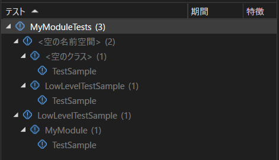

# [UE5] LowLevelTestでユニットテストを書く
今回は、機能としては以前から存在していたものの、UE5.3でドキュメントが追加されていた低レベルテスト(LowLevelTest, LLT)をさわってみたので、これについて紹介します。

https://docs.unrealengine.com/5.3/ja/low-level-tests-in-unreal-engine/

## 前置き

ユニットテストとは、開発者が自身で記述するテストで、関数やクラスなどごく小さい単位で行うテストを指すことが多いです。

Unreal Engineには、以前からユニットテストを書くことのできるツールに[Automation Spec]()や[Automation Testing]()があります。
これらのテストフレームワークは、実行するためにエディターを起動する必要があるため、ユニットテストなどを書いてビルドの度にテストを実行したい場合などにおいては実行速度に難がありました。

一方、今回ご紹介する低レベルテストは、テストコードを書くモジュールを単独の実行ファイルとしてビルドするため、**エディターを起動することなく**テストを実行することができ、実装->テストのイテレーションを高速に回すことができるようになります。最強です。
また、
> LLT は UObjects、アセット、エンジン コンポーネント などのさまざまな UE 機能で動作するように作成されています。

と、ドキュメントにあるように、UEの主要な機能も利用することができます。

さらに、低レベルテストはGoogleTestやCatch2といった有名なフレームワークを使用することができます。  
これを利用すると、以下のようにテストを記述することができ、Visual Studioのテストエクスプローラーからも一覧を見ることができるようになります。
```cpp
#include "CoreMinimal.h"
#include "TestHarness.h"

#include "MyObject.h"

namespace LowLevelTestSample {
	TEST_CASE("Name of Test", "[unit]")
	{
		SECTION("Sample")
		{
			auto* MyObject = NewObject<UMyObject>();
			CHECK(MyObject != nullptr);
		}
	}
}
```



低レベルテストには、テストモジュールを作成して記述する[明示的テスト](https://docs.unrealengine.com/5.3/ja/types-of-low-level-tests-in-unreal-engine/#明示的なテスト)、記述場所に制約のない[暗黙的テスト](https://docs.unrealengine.com/5.3/ja/types-of-low-level-tests-in-unreal-engine/#暗黙的テスト)があるようですが、現時点では、Visual Studioからテストを実行するには明示的テストを利用する必要があるようです。  
今回は明示的テストに絞った紹介をしていきます。  

## 環境
今回、検証した環境は以下のようになります
- Windows 11
- Visual Studio 2022
- VS Code  
    モジュールを記述するために利用しています。
- GitHubから取得したUnreal Engine 5.3  
    執筆時点ではLauncher版を利用することはできませんでした。

## 最初のテストを記述する
### モジュールを作成する  
では、ここから実際に最初のテストを記述するまでのセットアップを行っていきます。明示的テストを記述するためには、テスト用のモジュールを作成する必要があり、そのパスは`{プロジェクトのパス}\Source\Programs`以下になります。  
ここでは、テスト対象のモジュールを`MyModule`、テスト用モジュールの名前を`MyModuleTests`として、
- `Source\Programs\MyModule\MyModuleTests.Build.cs`
- `Source\Programs\MyModule\MyModuleTests.Target.cs`

の二つのファイルを作成してください。プロジェクトのフォルダ構成としては以下のようになります。
```
{プロジェクトのパス}\Source
├─LowLevelTestSample (プロジェクトフォルダ)
├─MyModule (テスト対象のモジュール)
│  ├─Private
│  ├─Public
│  └─MyModule.Build.cs
└─Programs
    └─MyModule
        ├─MyModuleTests.Build.cs
        └─MyModuleTests.Target.cs
```

ビルドファイル、ターゲットファイル、それぞれの中身は以下のように記載します。  

- `MyModuleTests.Build.cs`: 
    ```cs
    using UnrealBuildTool;

    public class MyModuleTests : TestModuleRules
    {
        public MyModuleTests(ReadOnlyTargetRules Target) : base(Target)
        {
            PrivateDependencyModuleNames.AddRange(new string[] {
                "Core",
                "CoreUObject",
                "MyModule",
            });

            PublicIncludePathModuleNames.AddRange(new string[]
            {
                "MyModule",
            });

            UpdateBuildGraphPropertiesFile(new Metadata { TestName = "MyModule", TestShortName = "MyModule" });
        }
    }
    ```
- `MyModuleTests.Target.cs`: 
    ```cs
    using UnrealBuildTool;

    [SupportedPlatforms(UnrealPlatformClass.All)]
    public class MyModuleTestsTarget: TestTargetRules
    {
        public MyModuleTestsTarget(TargetInfo Target): base(Target)
        {
            // 必要に応じてビルドに含めるコア機能を決める
            bCompileAgainstCoreUObject = true;
            bCompileAgainstApplicationCore = true;
            // bCompileAgainstEngine = true;
        }
    }
    ```
それぞれ、解説していきます。  
### ベースクラス
モジュールルール、ターゲットルールともにテスト用のクラス、`TestModuleRules`, `TestTargetRules`を継承します。これらのクラスは、UE5.3時点ではLauncher版で利用することができないようで、プロジェクトを切り替えようとすると以下のようなエラーが出てしまいます。


### 
`MyModuleTestsTarget`のコンストラクタ内で、`bCompileAgainstApplicationCore`などにより、エンジンの構成の有無を選択することができ、必要最低限のものを選択することでビルド時間を最小限にすることができます。

上記コードで`bCompileAgainstEngine`を切り替えながら、プロジェクトをクリーン・ビルドしてみると、
- `bCompileAgainstEngine = false;`の場合: 
    ```
    11>------ Building 68 action(s) started ------
    11>[1/68] Compile [x64] TestExterns.cpp
    ```
- `bCompileAgainstEngine = true;`の場合:  
    ```
    11>------ Building 108 action(s) started ------
    11>[1/108] Compile [x64] PCH.Core.cpp
    ```
のようにビルドのタスク数が変わってきます。この意味でも、プロジェクトをモジュールに分割することに意味があると思います。  


### テストを記述する


<!-- UE5のソースコードを読みながら、使い方を学習しており、適宜参考個所を記載していきます。 -->


## まとめ

低レベルテストは、
- エディターを起動しないため、テスト実行までのレイテンシーが低く高速である。
- Launcher版では利用できない。
- 独立したアプリケーションとしてビルドされるので、エディターからテストを実行することができない
- OSSのテストフレームワークを利用する。


## 参考文献
- LowLevelTestモジュールのREADME
- 